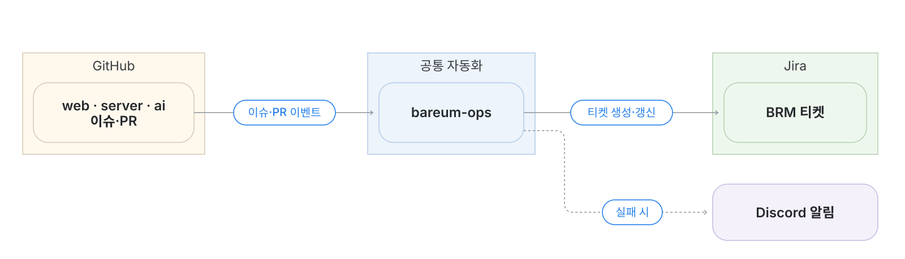

# bareum-ops

GitHub 이슈·PR과 Jira를 연결하는 팀 공통 자동화 저장소입니다. 동기화 로직은 여기서 관리하고, 각 레포에서는 호출용 워크플로를 실행합니다.

## 연동 구조



## 동기화 규칙

| GitHub 이벤트 | Jira 반영 |
|---|---|
| 이슈 생성 | 티켓 생성 및 연결 |
| 이슈 제목·내용·담당자 수정 | 티켓 갱신 |
| 연결된 일반 PR 생성 또는 Draft 해제 | In Review |
| 이슈 완료로 닫힘 | Done |
| 이슈 취소로 닫힘 | Cancelled |
| 이슈 재오픈 | 리뷰 가능한 연결 PR이 있으면 In Review, 없으면 To Do |
| GitHub 부모·서브 이슈 연결 | 모두 독립 Task·Bug로 유지하고 `relates to` 링크로 연결 |
| 서브 이슈의 부모 변경·연결 해제 | 자동화가 관리하는 관계 링크를 변경·제거. 기존 티켓 번호 유지 |

- PR 병합만으로 Done이 되지는 않습니다. **GitHub 이슈가 완료로 닫혀야 합니다.**
- 연결된 PR을 병합 없이 닫거나 Draft로 바꾸면, 다른 리뷰 가능한 연결 PR이 없는 경우 In Progress로 돌아갑니다.
- 연결할 이슈나 명시적인 Jira 키가 없는 PR은 티켓을 생성하거나 변경하지 않습니다.

스프린트·우선순위·Epic·추정치는 Jira에서 관리합니다. 작업을 시작할 때 **In Progress**로 직접 변경합니다.

## 주요 파일

| 경로 | 역할 |
|---|---|
| `.github/workflows/jira-sync.yml` | 공통 워크플로와 수동 실행 |
| `config/jira.mjs` | 대상 레포, Jira 프로젝트·상태 설정 |
| `scripts/jira-sync.mjs` | 동기화 실행 |
| `scripts/lib/` | API 호출, 연결 기록, 상태 처리 |
| `scripts/notify-failure.mjs` | Discord 실패 알림 |
| `tests/` | 자동화 테스트 |

## 설정

GitHub 조직의 **Settings → Secrets and variables → Actions**에서 관리합니다. 호출하는 레포에서 사용할 수 있도록 접근 범위를 설정해야 합니다.

| 구분 | 이름 | 용도 |
|---|---|---|
| Variable | `OPS_APP_ID` | GitHub App ID |
| Variable | `JIRA_ASSIGNEE_MAP` | GitHub 아이디 → Jira accountId 매핑 |
| Secret | `OPS_APP_PRIVATE_KEY` | GitHub App 인증 |
| Secret | `JIRA_CLIENT_ID` | Jira OAuth 클라이언트 ID |
| Secret | `JIRA_CLIENT_SECRET` | Jira OAuth 클라이언트 Secret |
| Secret | `DISCORD_WEBHOOK_URL` | 실패 알림 · 선택 사항 |

담당자 매핑은 아래 형식으로 입력합니다. 팀원 추가 시 코드를 수정할 필요는 없습니다.

```json
{
  "github-login": "jira-account-id"
}
```

## 실행 및 확인

**자동 실행:** 각 레포의 이슈·PR 이벤트로 실행됩니다. 실행 결과는 해당 레포의 **Actions → Jira sync**에서 확인합니다. 정기 관계 동기화 실행은 bareum-ops에서 확인합니다.

**수동 실행:** bareum-ops의 **Actions → Jira sync → Run workflow**에서 선택합니다.

| 모드 | 동작 |
|---|---|
| `verify` | GitHub·Jira 접근 권한과 설정 확인. 티켓 변경 없음 |
| `issue` | `repository`와 `issue-number`로 지정한 기존 이슈 동기화 |
| `hierarchy` | 네 저장소의 연결된 이슈를 확인해 관계 링크 연결·이동·해제 반영. 저장소·이슈 번호 입력은 사용하지 않음 |

**로컬 테스트:** Node.js 22 환경에서 실행합니다.

```bash
node --test tests/*.test.mjs
```

동기화 실패나 담당자 경고가 발생하면 Actions 로그를 확인합니다. 담당자 매핑, 인증 정보, Jira 접근 권한을 확인하고, 문제를 해결한 뒤 `issue` 모드로 해당 이슈를 다시 동기화할 수 있습니다.
